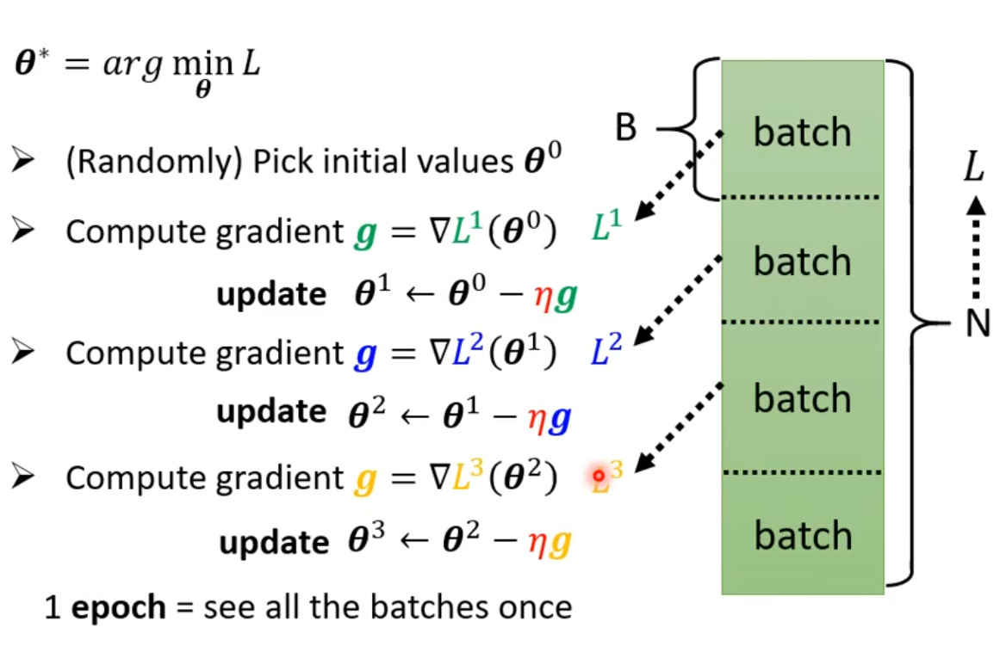

# Lesson 1 课程大纲 深度学习基本概念简介

`Neural Network == Deep Learning`

## 课程大纲

+ 前五讲 Supervised Learning
+ 第六讲 Generative Adversarial Network
  Unlabeled -> Pretrain -> New Task

1. 未标注的数据，通过反转、更换颜色等方式让AI进行预训练，得到general knowledge
2. 之后经过微调就能直接处理下游任务

+ 第七讲 Self-supervised Learning
+ 第八讲 Anomaly Detection 异常检测 "IDK"
+ 第九讲 Explainable AI
+ 第十讲 Model Attack
+ 第十一讲 Domain Adaptation
+ 第十二讲 Reinforcement Learning
+ 第十三讲 Network Compression
+ 第十四讲 Life-long Learning
+ 第十五讲 Meta Learning 学习如何学习 （few-shot learning）

## 机器学习：让机器寻找一个函数

深度学习：使用神经网络的机器学习

### 这个函数可以是不同种类的

输入可以是

+ 向量
+ 矩阵
+ 序列

输出可以是

+ 数值 - 回归任务regression
+ 类别 - 分类任务classification
+ 文本、图片等

### 由训练数据定义损失

损失函数是一个关于参数的函数: $L(b,w)$
训练集作为函数的参数

### 梯度下降最优化参数

## 使用非线性函数拟合任意函数

> 激活函数是用来提供非线性的！只有非线性才能拟合不同函数

一堆**非线性函数**的线性组合可以用来表示分段函数，进而可以**拟合任意的函数**，即：

> $$
> 任意函数=\sum_i{c_i\cdot非线性函数}+常数
> $$

非线性的函数如

> $$
> Sigmoid(b+wx)=\frac{1}{1+e^{-(b+wx)}}
> $$

使用这样的函数拟合一元函数 $y=wx+b$

> $$
> y=b+\sum_i c_iSigmoid(b_i+w_ix)
> $$

如果要拟合多元的函数 $y=\sum_j w_jx_j$

> $$
> y=\sum_i c_i Sigmoid(\sum_j w_{ij}x_j+b_i)+b
> $$
> 
> 注意，是把整个多元函数的部分塞到sigmoid里面

将矩阵中所有的参数与参数矩阵拉长成为一个长的向量 $θ$

## 新的Loss的定义方法

> $$
> L(θ)=\frac{\sum_n e_n}{N}
> $$
> 
> 这里的$e$是偏差，$n$是训练集的规模
> 
> $$
> e_i=y_i-\hat{y_i}
> $$

## Optimization

> $$
> θ^*=arg min L(θ)
> $$

对 $L(θ)$ 求梯度：

之后使用梯度下降法求 $L(θ)$ 局部最小值：

 

### 实际上的optimize方法

把整个训练集随机划分为几个batch
在梯度下降的每一步（称为一次update）分别使用不同的batch来更新
而遍历完一次所有的batch称为一次epoch

## 哪些属于超参数？

- learning rate 一步有多大
- batch size
- layer
- ...

## 其他非线性

### ReLU 两个ReLU可以凑出一个Hard Sigmoid

ReLU方便求导

## overfitting

---

