# Preview 1 Optimization攻略

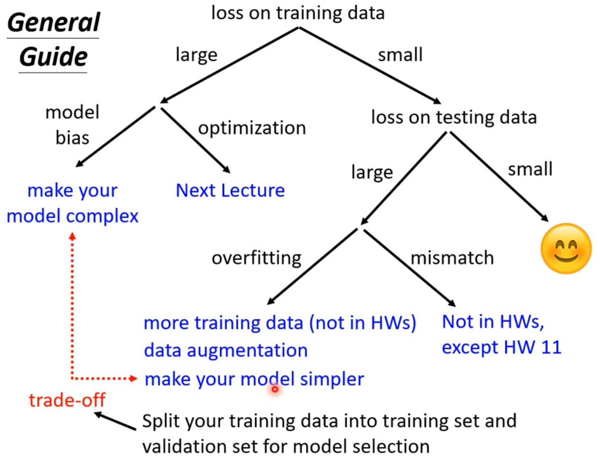

## 训练集上损失大

### 模型本身的偏差：模型弹性不够或忽略了重要feature

“模型能表示的函数”这个集合太小，不包括想要的函数

增加模型的弹性就是增加模型的复杂度，就是增加参数的数量与结构的复杂度

> 增加模型输入的feature（即增加第一层的参数数量、让模型变得更胖、让模型能表示更加复杂的函数）

> 增加模型的Layer与neurons

### Optimization不足

卡在 local minimum，而非模型弹性不足
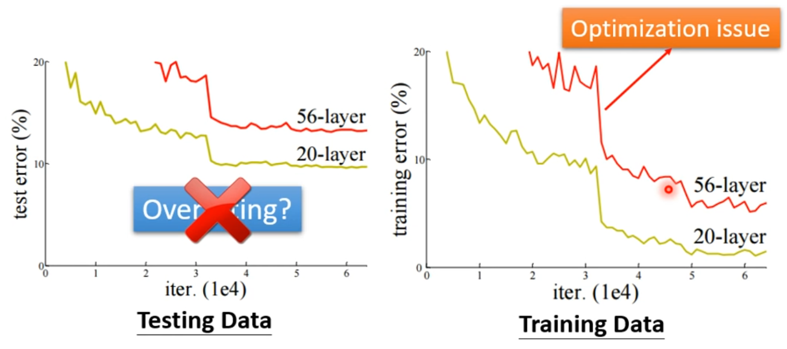

> 判断是模型本身的问题还是Optimization不足，可以通过一个较小、浅的模型，
> 这种模型Optimization难度较低，他的Optimization比较容易
> 这时候如果大的模型的loss比小的更大，那就说明是Optimization不足
> 具体solution见下一节课

## 训练集loss小了，但是测试集loss大

### 过拟合 overfitting

> 增加训练集
> Data augmentation

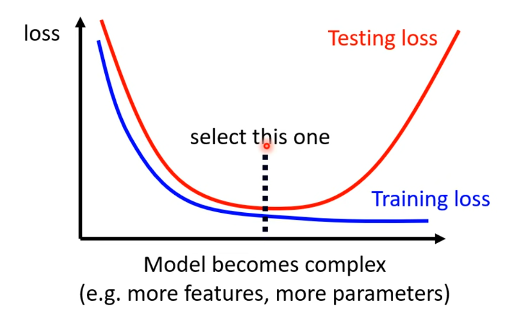

### 错配 mismatch

训练资料与测试资料分布不同

# Preview 2 Optimization失败了怎么办

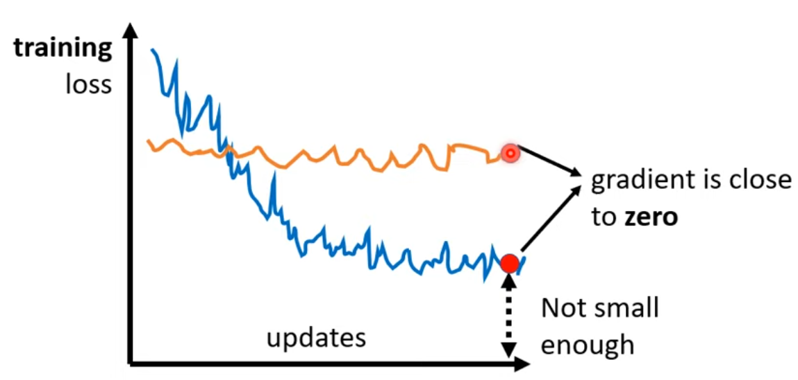

optimization失败，也就是梯度为0
分为2种情况，一种是saddle point，一种是local minima
由于实际的训练是在高维空间进行的，过半的情况都是saddle point

# Preview 3 batch & momentum

## batch：size大一点还是小一点好？

### 时间开销

由于GPU并行计算的存在，一次update的耗时与batch size并不是线性的，在一定范围内，随着batch size增大，update耗时几乎不变。

而对于整个epoch，大的batch速度更快

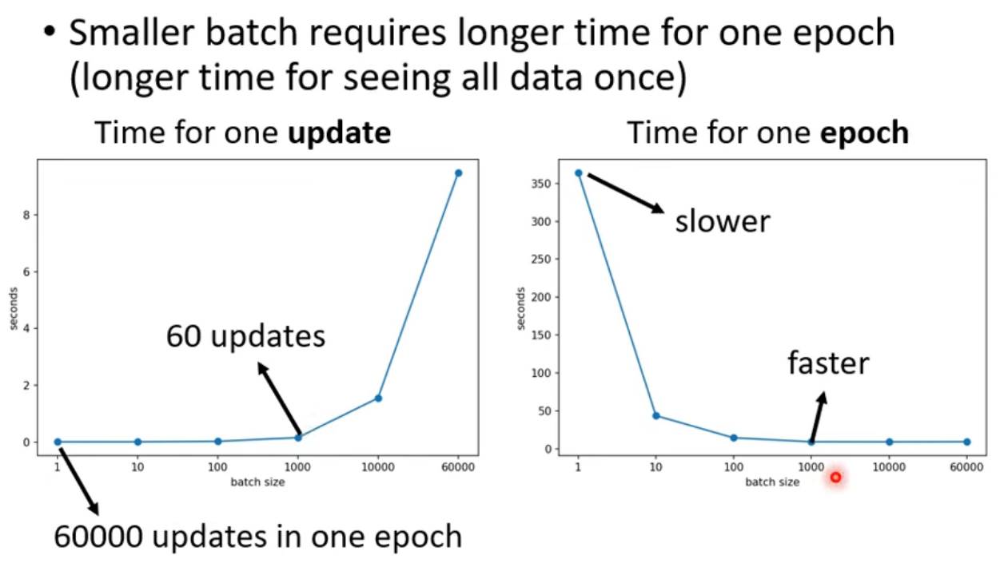

### 优化性能

在训练集与验证集中，小一点的batch size效果更好
也就是带有一点噪声的loss居然能达到更好的效果！

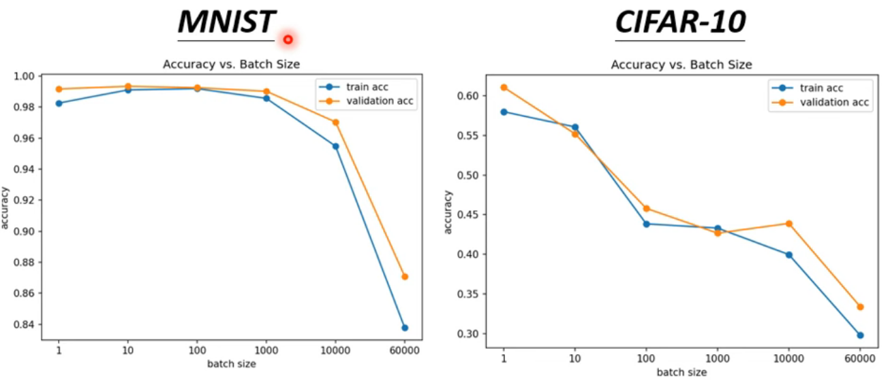

多样化的loss更容易找到optimization的方向
在一个batch中卡主的时候，另一个batch能够使他更让他容易逃出来

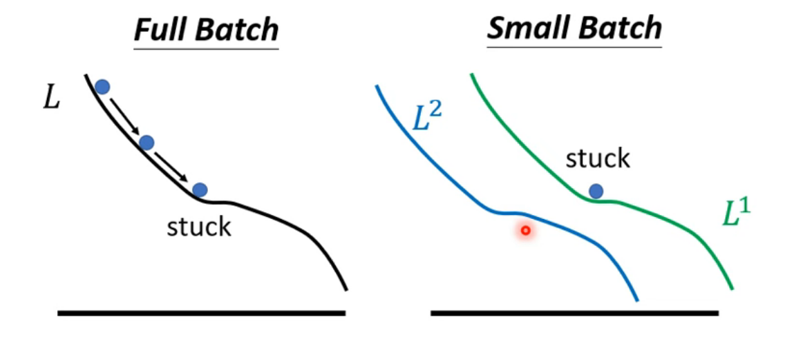

小的batch还能避免overfitting：

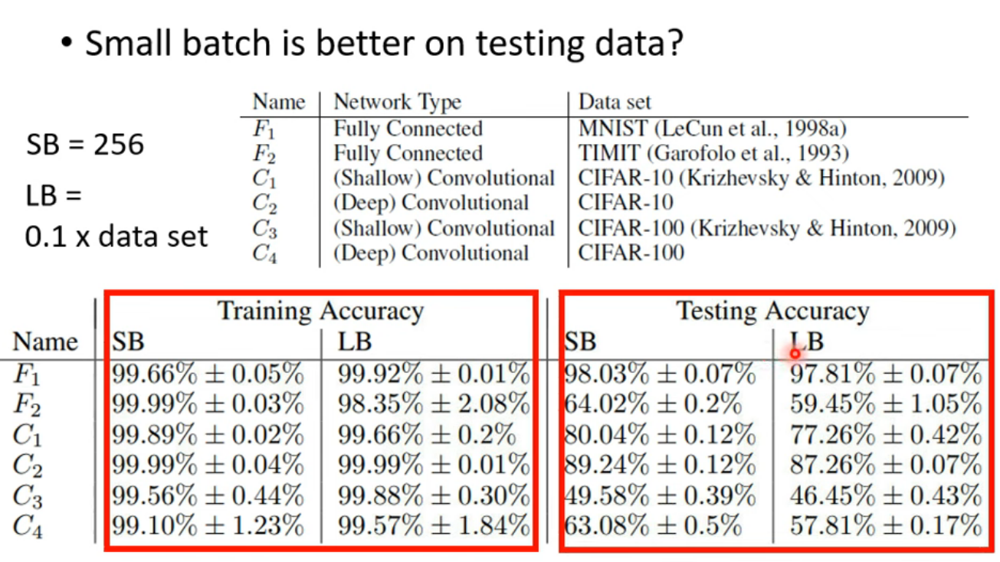

为什么？

- “盆地”形状的minima能更好的适用于testing set，而“深井”形式的最小值对参数取值过于敏感，容易导致overfitting
  所以**我们更喜欢的minima是“盆地”形状的，不喜欢“深井”类型的**
  
  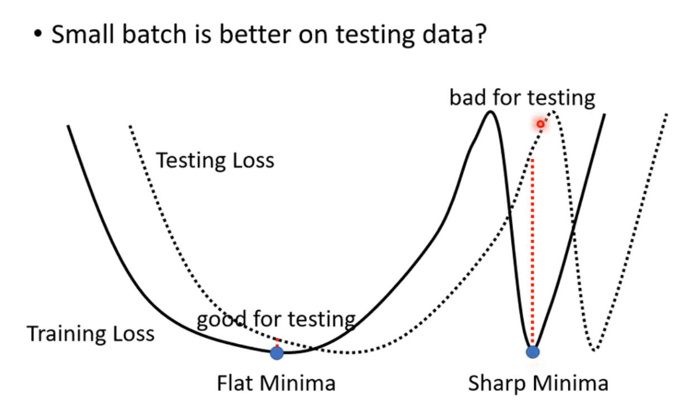
- 而small batch本来就有类似于testing data的比较不一样的分布，天生就更容易走到盆地而非深井

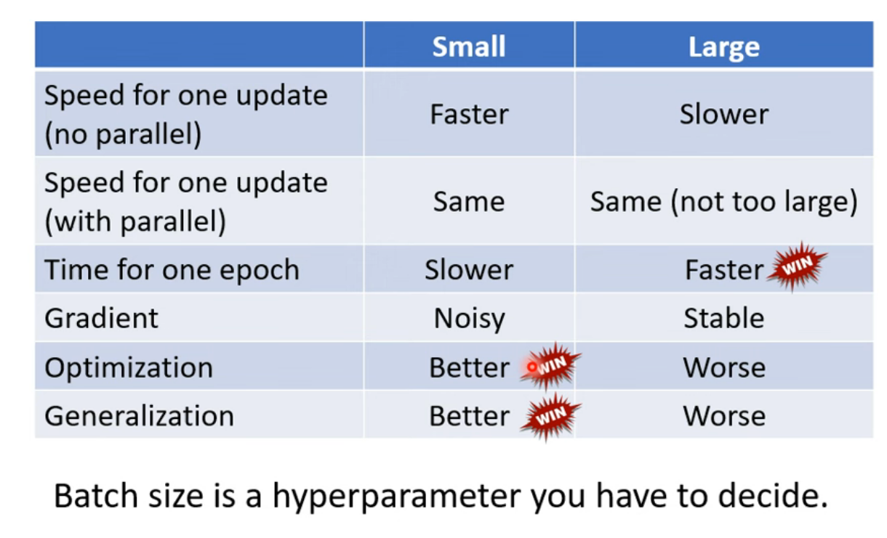

## Momentum

每次迭代不只是$学习率\cdot梯度$，而是加上前一步的加权，
即

$$
v_t = \beta \cdot v_{t-1} + (1-\beta) \cdot \nabla L(\theta_t)
$$

$$
\theta_{t+1} = \theta_t - \eta \cdot v_t
$$

# Preview 4 Learning Rate

传统的梯度下降使用梯度和学习率决策下一步的参数选择

$$
\theta_{t+1} = \theta_t - \eta \cdot \nabla L(\theta_t)
$$

原先的固定学习率的学习过程会有很多问题，学习率大了会左右横跳，小了会一直到不了minima。

所以需要**为每个参数指定不同的学习率**，但是手动指定很慢，我们需要一个方法**自动地**为每个参数、甚至每次update指定学习率，
即

$$
\theta_{t+1} = \theta_t - \frac{\eta}{\sigma_t} \cdot \nabla L(\theta_t)
$$

显然，我们需要在**平缓**的时候**增大**学习率，所以需要比较**小**的$\sigma$，反之亦然

## 调整的方法

经典梯度下降法中，每一步只考虑当前点的梯度，会导致训练结果不理想

引入对每个参数、每次update自适应的学习率，实质上是使用过去update的参数点处的梯度信息，表征损失函数全局的梯度大小

即实际上是在践行这两条规则：

- 全局梯度大的慢慢走，梯度小的快快走
- 局部梯度大的快快走，梯度小的慢慢走

### 平方平均数

$$
\sigma_t=\sqrt{\frac{\sum_{i=0}^t{[\nabla L(\theta_i)]^2}}{t+1}}
$$

- 适合处理稀疏数据
- 存在学习率衰减过早的问题

### RMSProp

$$
\sigma_t=\sqrt{\alpha\cdot(\sigma_{t-1})^2+(1-\alpha)\cdot[\nabla L(\theta_i)]^2}
$$

- 能手动地调整历史梯度和当前点梯度的权重（反应的速度）
- 仍然会有$\sigma$累积到一个小值之后之后步长“喷发”的问题

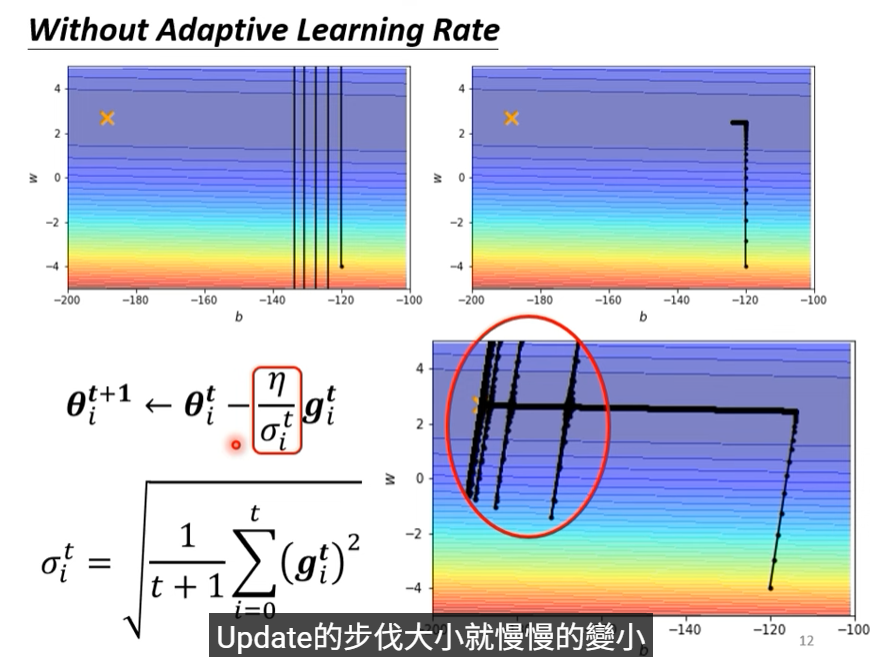

### Adam: RMSProp + Momentum

### Learning Rate Scheduling

先验地调整Learning Rate

#### Learning Rate Decay

解释：参数逐渐趋于稳定、收敛

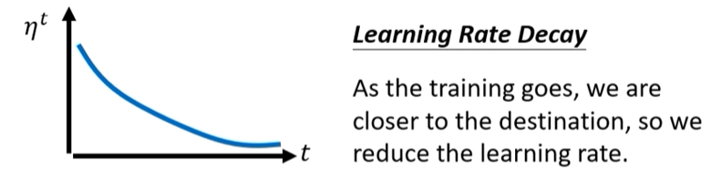

#### Warm up

解释：一开始的时候$\sigma$不太准确，先粗略的train一下

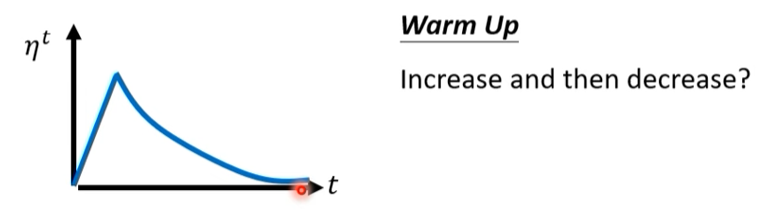

## 这样做的目的？

# Lesson 2 宝可梦、数码宝贝分类器

> 得开始加速喽~

